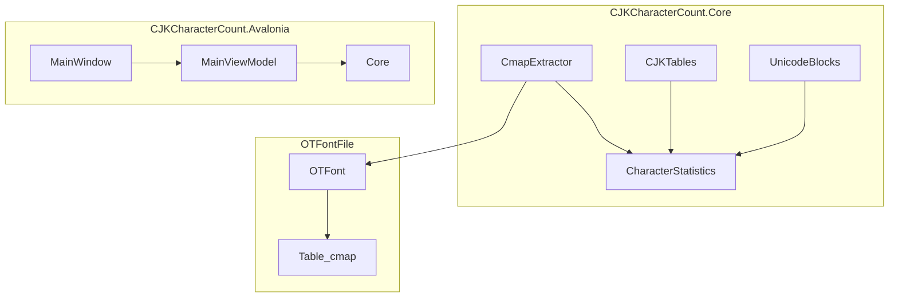

# CJK Character Count .NET 10 Migration Plan

## 概述 Overview

将 Python 库 `CJK-character-count` 移植到 .NET 10 LTS，使用现有 `OTFontFile` 库解析字体，Avalonia 11 提供跨平台 GUI。目标：高性能、低内存、SIMD 优化。

---

## 决策确认

| 决策项 | 选择 | 备注 |
|--------|------|------|
| GUI 框架 | **Avalonia 11** | 支持 NativeAOT，包体小 |
| 目标框架 | **.NET 10 LTS** | 单目标，不多版本兼容 |
| CLI 工具 | **首版不实现** | 后续按需添加 |
| 本地化 | **.resx 资源文件** | 标准 .NET 方案 |

---

## 目标架构



---

## Proposed Changes

### Component 1: CJKCharacterCount.Core

核心库，无 UI 依赖，支持 NativeAOT。

#### [NEW] [CJKCharacterCount.Core.csproj](file:///f:/GitHub/FontFlat/CJKCharacterCount.Core/CJKCharacterCount.Core.csproj)

```xml
<Project Sdk="Microsoft.NET.Sdk">
  <PropertyGroup>
    <TargetFramework>net10.0</TargetFramework>
    <Nullable>enable</Nullable>
    <AllowUnsafeBlocks>true</AllowUnsafeBlocks>
    <PublishAot>true</PublishAot>
  </PropertyGroup>
  <ItemGroup>
    <ProjectReference Include="..\OTFontFile\OTFontFile.csproj" />
  </ItemGroup>
</Project>
```

---

#### [NEW] [CmapExtractor.cs](file:///f:/GitHub/FontFlat/CJKCharacterCount.Core/CmapExtractor.cs)

```csharp
public static class CmapExtractor
{
    /// <summary>提取字体中所有已映射的 Unicode 码点</summary>
    public static HashSet<int> ExtractCodePoints(OTFont font);
    
    /// <summary>批量处理 TTC 中所有字体</summary>
    public static Dictionary<int, HashSet<int>> ExtractFromCollection(OTFile file);
}
```

---

#### [NEW] [UnicodeBlock.cs](file:///f:/GitHub/FontFlat/CJKCharacterCount.Core/Unicode/UnicodeBlock.cs)

```csharp
public readonly struct UnicodeBlock
{
    public required string Name { get; init; }
    public required int StartCode { get; init; }
    public required int EndCode { get; init; }
    public required ReadOnlyMemory<(int Start, int End)> AssignedRanges { get; init; }
    
    /// <summary>SIMD 加速码点包含检测</summary>
    public bool Contains(int codePoint);
    
    /// <summary>批量统计覆盖数量</summary>
    public int CountOverlap(ReadOnlySpan<int> sortedCodePoints);
}
```

---

#### [NEW] [CJKTable.cs](file:///f:/GitHub/FontFlat/CJKCharacterCount.Core/Tables/CJKTable.cs)

```csharp
public sealed class CJKTable
{
    public required string Id { get; init; }
    public required CJKGroup Group { get; init; }
    
    // 使用 FrozenSet<int> 存储码点，O(1) 查找
    private readonly FrozenSet<int> _codePoints;
    public int Count => _codePoints.Count;
    
    /// <summary>SIMD 加速交集计算</summary>
    public int CountOverlap(ReadOnlySpan<int> sortedCodePoints);
    
    /// <summary>获取缺失字符</summary>
    public IEnumerable<int> GetMissingCharacters(HashSet<int> fontCodePoints);
}

public enum CJKGroup { Simplified, Mixed, Traditional }
```

---

#### [NEW] [FontAnalyzer.cs](file:///f:/GitHub/FontFlat/CJKCharacterCount.Core/FontAnalyzer.cs)

```csharp
public sealed class FontAnalyzer
{
    public string FontPath { get; }
    public string FontName { get; }
    public HashSet<int> CodePoints { get; }
    
    public FontAnalyzeResult Analyze();
    public static FontAnalyzer FromFile(string path, int fontIndex = -1);
    public static IReadOnlyList<string> GetFontsInCollection(string path);
}
```

---

### Component 2: 本地化 (.resx)

使用标准 .resx 资源文件管理多语言字符串。

#### [NEW] [Resources/Strings.resx](file:///f:/GitHub/FontFlat/CJKCharacterCount.Core/Resources/Strings.resx)
#### [NEW] [Resources/Strings.zh-Hans.resx](file:///f:/GitHub/FontFlat/CJKCharacterCount.Core/Resources/Strings.zh-Hans.resx)
#### [NEW] [Resources/Strings.zh-Hant.resx](file:///f:/GitHub/FontFlat/CJKCharacterCount.Core/Resources/Strings.zh-Hant.resx)

```xml
<!-- Strings.resx (English, default) -->
<data name="AppTitle" xml:space="preserve">
  <value>CJK Character Count</value>
</data>
<data name="Menu_Open" xml:space="preserve">
  <value>Open</value>
</data>
<data name="Section_Simplified" xml:space="preserve">
  <value>Chinese (Simplified) Encodings</value>
</data>
<!-- ... -->
```

```csharp
// 使用方式
public static class Loc
{
    public static string Get(string key) => Strings.ResourceManager.GetString(key, CultureInfo.CurrentUICulture) ?? key;
}

// 切换语言
CultureInfo.CurrentUICulture = new CultureInfo("zh-Hans");
```

---

### Component 3: SIMD 优化

#### 高性能码点范围检测

```csharp
public static int CountInRange(ReadOnlySpan<int> codePoints, int start, int end)
{
    int count = 0, i = 0;
    
    if (Vector256.IsHardwareAccelerated && codePoints.Length >= Vector256<int>.Count)
    {
        var vStart = Vector256.Create(start);
        var vEnd = Vector256.Create(end);
        
        for (; i <= codePoints.Length - Vector256<int>.Count; i += Vector256<int>.Count)
        {
            var v = Vector256.LoadUnsafe(ref MemoryMarshal.GetReference(codePoints), (nuint)i);
            var inRange = Vector256.BitwiseAnd(
                Vector256.GreaterThanOrEqual(v, vStart),
                Vector256.LessThanOrEqual(v, vEnd));
            count += BitOperations.PopCount((uint)Vector256.ExtractMostSignificantBits(inRange));
        }
    }
    
    for (; i < codePoints.Length; i++)
        if (codePoints[i] >= start && codePoints[i] <= end) count++;
    
    return count;
}
```

---

### Component 4: CJKCharacterCount.Avalonia

#### [NEW] [CJKCharacterCount.Avalonia.csproj](file:///f:/GitHub/FontFlat/CJKCharacterCount.Avalonia/CJKCharacterCount.Avalonia.csproj)

```xml
<Project Sdk="Microsoft.NET.Sdk">
  <PropertyGroup>
    <OutputType>WinExe</OutputType>
    <TargetFramework>net10.0</TargetFramework>
    <Nullable>enable</Nullable>
    <PublishAot>true</PublishAot>
  </PropertyGroup>
  <ItemGroup>
    <PackageReference Include="Avalonia" Version="11.*" />
    <PackageReference Include="Avalonia.Desktop" Version="11.*" />
    <PackageReference Include="Avalonia.Themes.Fluent" Version="11.*" />
    <PackageReference Include="CommunityToolkit.Mvvm" Version="8.*" />
    <ProjectReference Include="..\CJKCharacterCount.Core\CJKCharacterCount.Core.csproj" />
  </ItemGroup>
</Project>
```

#### 主窗口布局

- **顶部**: 工具栏（打开、保存、语言、主题）
- **左侧**: CJK 字表统计（分组）
- **右侧**: Unicode 块统计
- **底部**: 状态栏（字体信息）

---

## 资源文件迁移

18 个 `cjk-tables/*.txt` 嵌入为资源：

```xml
<ItemGroup>
  <EmbeddedResource Include="Resources\Tables\*.txt" />
</ItemGroup>
```

---

## Performance Targets

| 指标 | 目标 | 实现方式 |
|------|------|----------|
| 字体加载 | < 100ms | 延迟加载 |
| 统计计算 | < 50ms | SIMD + FrozenSet |
| 内存占用 | < 50MB | 结构体优化 |
| 启动时间 | < 1s | NativeAOT |

---

## Verification Plan

### Unit Tests

1. CmapExtractor：验证码点提取
2. CJKTable：验证表加载
3. SIMD 路径：结果一致性

### Integration Tests

使用 `GenYoGothicTW-R.ttf` 验证与 Python 版输出一致。

---

## Implementation Order

### Phase 1: Core Library
- [ ] 创建 `CJKCharacterCount.Core` 项目
- [ ] 实现 `CmapExtractor`
- [ ] 实现 `UnicodeBlock` / `UnicodeBlocks`
- [ ] 实现 `CJKTable` + 表解析器
- [ ] 嵌入 18 个字表资源
- [ ] 实现 `FontAnalyzer`
- [ ] 实现 .resx 本地化
- [ ] 编写单元测试

### Phase 2: Avalonia GUI
- [ ] 创建 Avalonia 项目
- [ ] 实现 MainWindow
- [ ] 实现 ViewModel
- [ ] 实现主题切换
- [ ] 实现报告导出
- [ ] 实现剪贴板功能

---

## Dependencies

| 依赖 | 版本 | 用途 |
|------|------|------|
| OTFontFile | 项目引用 | 字体解析 |
| Avalonia | 11.x | GUI |
| CommunityToolkit.Mvvm | 8.x | MVVM |
